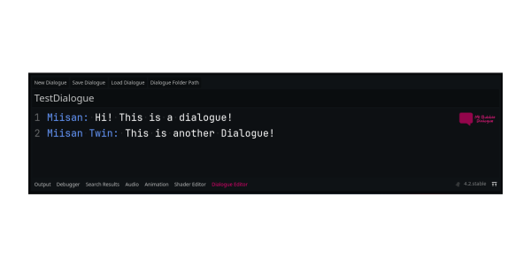
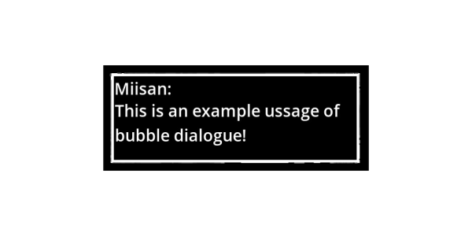

# BubbleDialogue


BubbleDialogue is a simple easy to use dialogue plugin for godot 4.2 :) I made this for my game and now i am releasing it public :) 

## Features
-  Customizable dialogue bubbles
-  User-friendly editor integration

## Installation

1. Download the BubbleDialogue plugin
2. Copy the `addons/BubbleDialogue` folder into your Godot project
3. Enable the plugin in Project Settings -> Plugins

## Usage

### Creating a Dialogue

1. Open the BubbleDialogue editor panel
2. Click "New Dialogue"
3. Write your dialogue in the editor:

```
Character1: Hello there!
Character2: Hi! How are you?
Character1: I'm doing great, thanks for asking!
```

4. Save your dialogue



### Using Dialogue in Your Game

Add a BubbleDialogue node to your scene and use the following code:

```gdscript
extends Node2D

@onready var bubble_dialogue = $BubbleDialogue

func _ready():
    bubble_dialogue.play("YourDialogueName")
```

## Example



## Contributing

Contributions are welcome! WWW

## License

This project is licensed under the MIT License 
